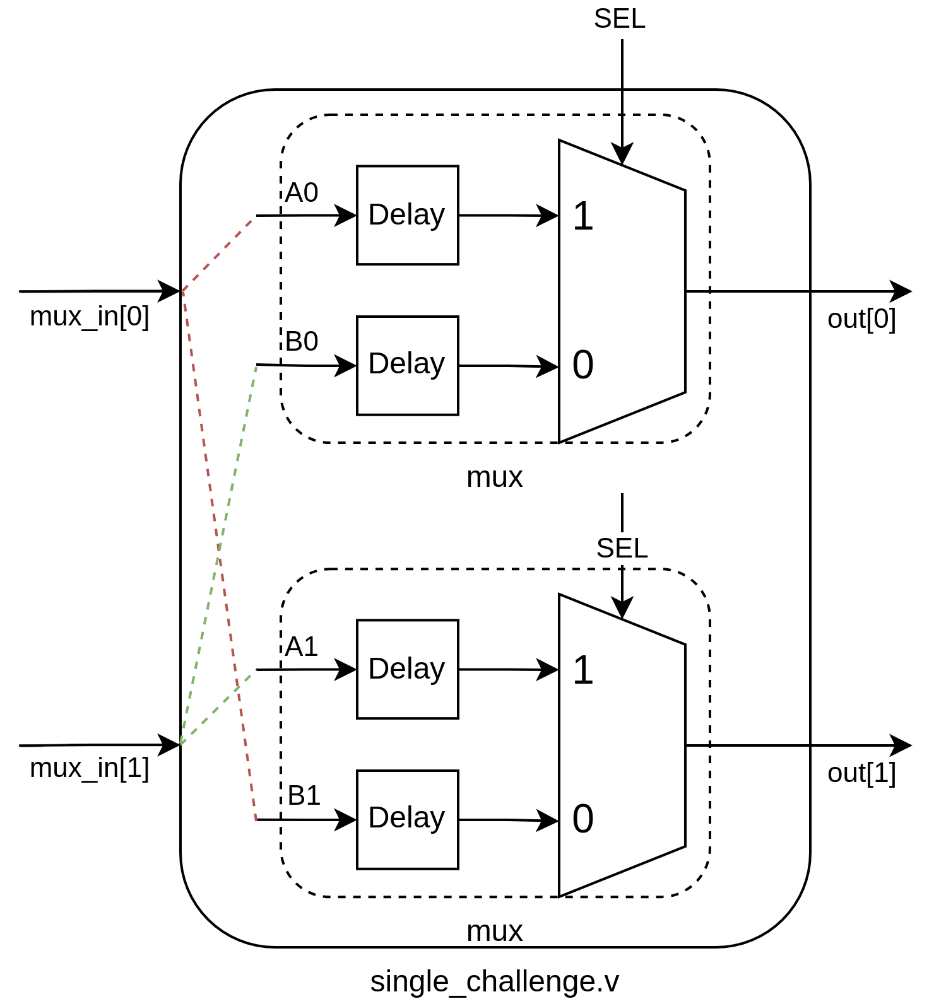
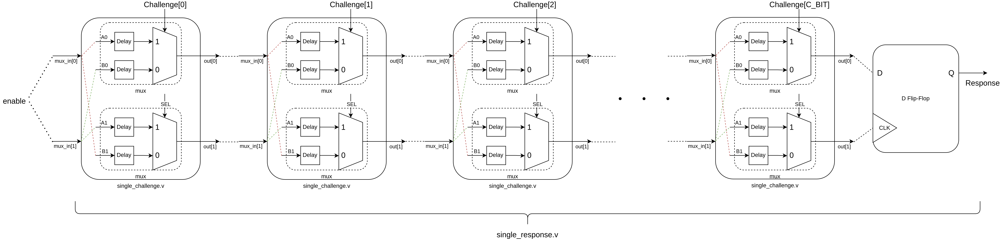
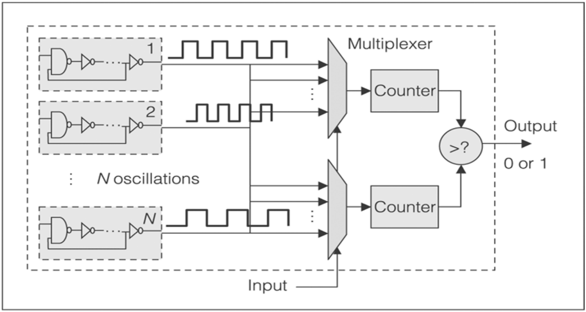
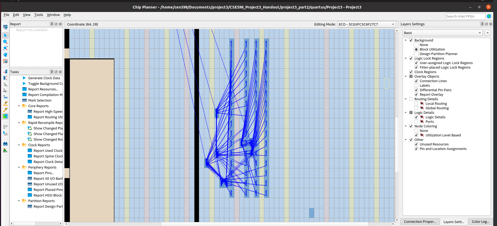

## Project: Ring Oscillator PUF (Physically Un-clonable Function) Device.

Built and simulated an Arbiter PUF using RTL techniques, leveraging delay differences in multiplexers to create unique responses for various challenges and devices, as a part of the CEN 598 course.

<!-- <object>
<embed src="./media/single_challenge.png" type="application/pdf" width="493" height="528">
</object> -->

Further, implemented an Ring Oscillator PUF.

> The Ring Oscillator(RO) PUF uses multiple Ring Oscillators to increment counters. Variations in fabrication mean that each RO will have a unique frequency. When two counters use different RO outputs as a clock, one counter will finish before the other. Checking which counter finished first provides a source of randomness unique to each device. Multiple PUF challenges are supported by providing several ROs to choose from when clocking each counter. Multiple PUF response bits are generated with multiple pairs of counters racing to the max count value.

<!-- 

	<object>
		<embed src="./media/ring_osc_output.png" width="622" height="284">
	</object>

 -->

Successful Synthesis of an RO-PUF using Verilog.

## Report 

    <object>
        <embed src="./media/PUF_report.pdf#zoom=100" type="application/pdf" width="800px" height="900px">
    </object>

