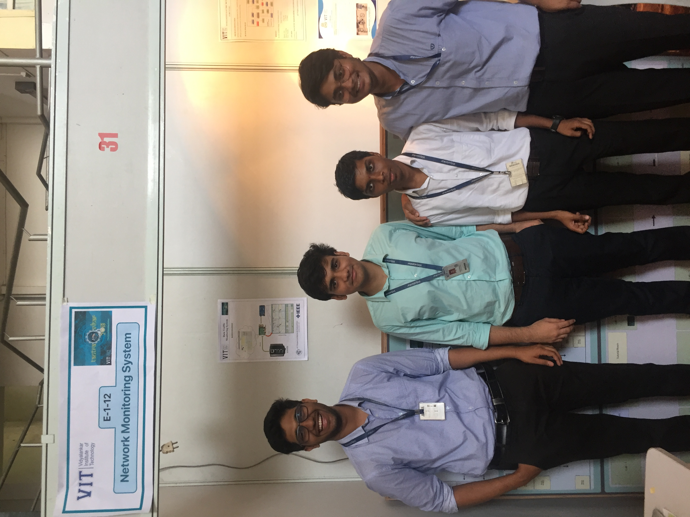
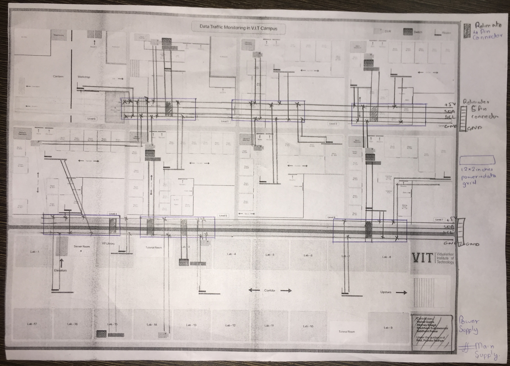
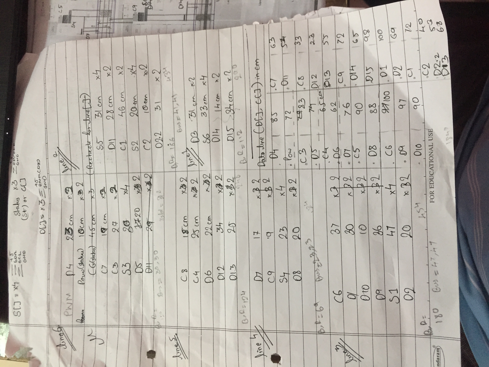
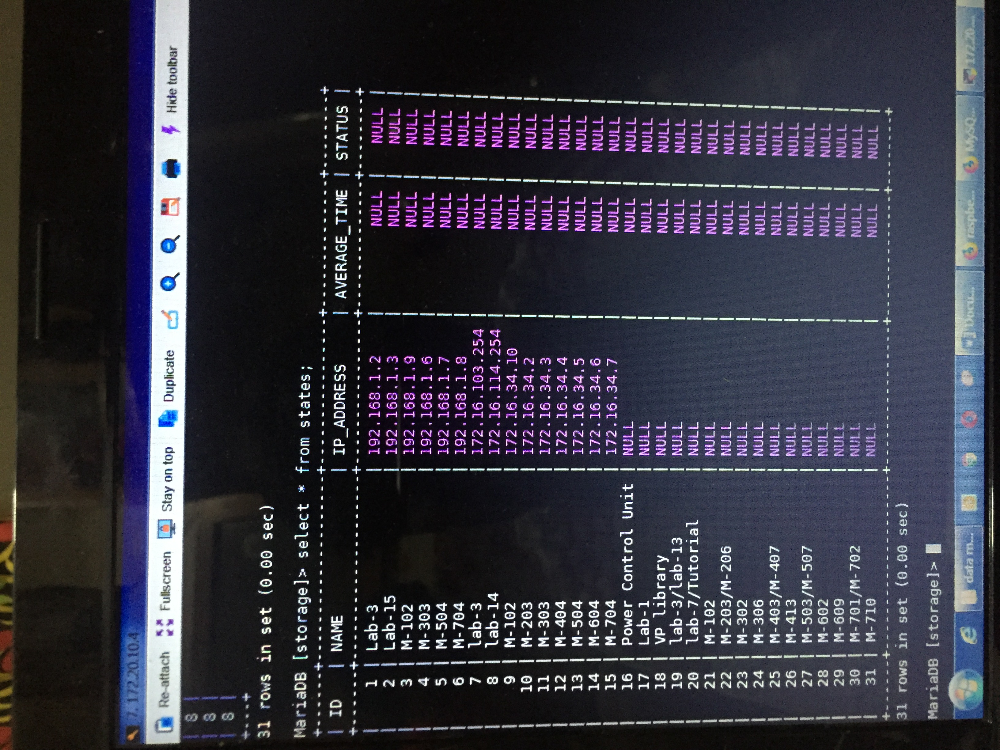

## Data Traffic Monitoring System

<iframe width="560" height="315" src="https://www.youtube.com/embed/LVsCxXE_NcU?si=0bg8uhT3QV1-odbb" title="YouTube video player" frameborder="0" allow="accelerometer; autoplay; clipboard-write; encrypted-media; gyroscope; picture-in-picture; web-share" allowfullscreen></iframe>

<iframe width="560" height="315" src="https://www.youtube-nocookie.com/embed/-GwJVSw2Fag?si=oPrxsQWow9_rq14L" title="YouTube video player" frameborder="0" allow="accelerometer; autoplay; clipboard-write; encrypted-media; gyroscope; picture-in-picture; web-share" allowfullscreen></iframe>

Innovation Showcase- April, 2018.

## Electrical Circuits Diagrams

- LCD modules with filter circuits & pull-up resistors

- I2C line module for debugging and modularization.

- I/O Expander board. 

## Electrical Information System Schematics Diagram
<!-- 
 -->

## Database
An illustration of the subset of the actual Database that calculated & stored the real-time latency information for >120 Devices/Nodes.
 
