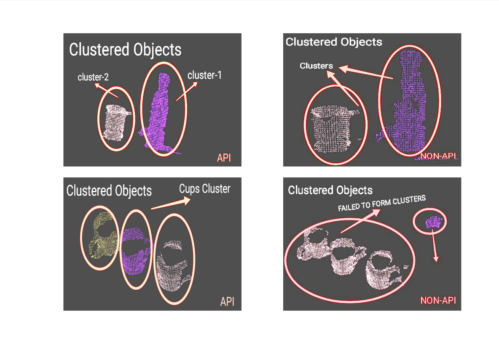
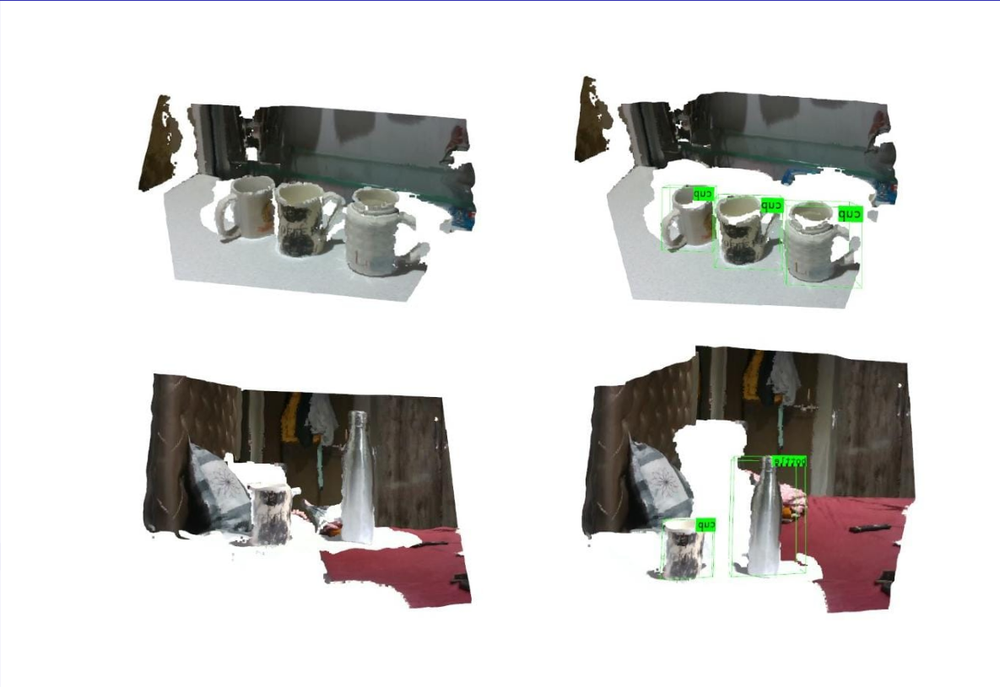

# Projects

- [Higher Dimensional Mandelbrot & Julia using Geometric Algebra](), STAM Center, ASU
	
	>

- [Ring Oscillators]()

Desiging a PUF (Physically Unconneble device), as a part of the CEN 598 course.

> The Ring Oscillator(RO) PUF uses multiple Ring Oscillators to increment counters. Variations in fabrication mean that each RO will have a unique frequency. When two counters use different RO outputs as a clock, one counter will finish before the other. Checking which counter finished first provides a source of randomness unique to each device. Multiple PUF challenges are supported by providing several ROs to choose from when clocking each counter. Multiple PUF response bits are generated with multiple pairs of counters racing to the max count value.

- [Flash-Memory Dev-board for FPGA]()

<object>
<embed src="./media/Generic-flash-memory-PCB-layout-&-design.pdf#page=1&zoom=60" type="application/pdf" width="600px" height="400px">
</object>

- [Novozymes Enzyme Stability Prediction](), STAM-Center ASU

  > Source: [Kaggle Competition](https://www.kaggle.com/competitions/novozymes-enzyme-stability-prediction/discussion) 
  - RNN-LSTM model with R2 94% accuracy score, for predicting thermal stability of amino acids sequential data.

- [Agribot](), IIT Bombay

  > [Demonstration](https://youtu.be/cgiHJSOUb5I)  
  > [Resource](https://github.com/erts-RnD/eYRC-2021_Agribot)
  - Autonomous UGV with UR5 in actual Greenhouse with remote access. Paper under review (Continuation of Sahayak Bot project).
  - Bolster distant hands-on learning for 20+ students in isolated corners of India.

- [Accelerated 3D-Perception IIT Bombay]()

  > [Reference](https://arxiv.org/pdf/2006.00049.pdf)
  - 3D data filter pipeline developed using Point Cloud Library, adjunct with CNN model for object recognition.
  - Aim to alleviate price & energy requirements by implementation on Xilinx’s Ultra96 MPSoC using Vivada HLS language.
  
  

<!-- <object>
<embed src="./content/projects/media/e_YSIP21_21_3D_Perception_progress_ppt_II.pdf" type="application/pdf" width="600px" height="400px">
</object> -->

- [Sahayak Bot](), IIT Bombay

  > **[Publication]()**  
  > [Resources](https://github.com/erts-RnD/sahayak_bot)
  - Development of a UGV with UR5, both actual & simulation models for generic autonomous pick-&-place and navigation applications.
  - Facilitated teaching 5446 students the challenges associated with industrial robotics to date.

- [Depth Perception](), IIT Bombay

  > **[Publication](https://ieeexplore.ieee.org/document/9588784)**  
  > [Resources](https://github.com/erts-RnD/sahayak_bot)
  - Study of 3 vSLAM (Computer vision) methods, PTAM, ORB-SLAM2 & CNN model, to generate point cloud data, & mapping with an onboard monocular camera on a DJI Tello drone.

- [Quadcopter Stabilization in Gazebo](), IIT Bombay

  > [Resources](https://github.com/rishikeshrmadan/survey_and_rescue)
  - Enabled 0 cost learning through building a custom simulation model of a nano-drone in the Gazebo simulator, based on the RotorS framework (LQR controller). Adjunct with Image-processing for waypoint detection & path-planning.

- [Data Traffic Monitor System](), University of Mumbai
  
  > **BE Thesis Project**
  - An RTOS system with a 6.5ftx3ft physical board, depiction college's IT infrastructure & relaying latency information of any node within the intra-network.
  - Similar information conveyed through website. Concepts like RTOS, signal processing & multithreading enabled the system to perform calculations & information broadcasting within 200ms.
