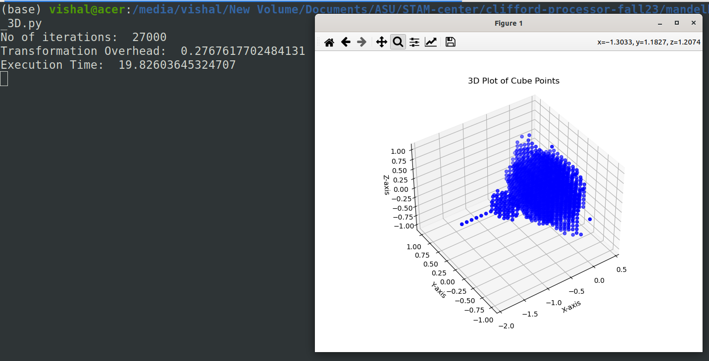
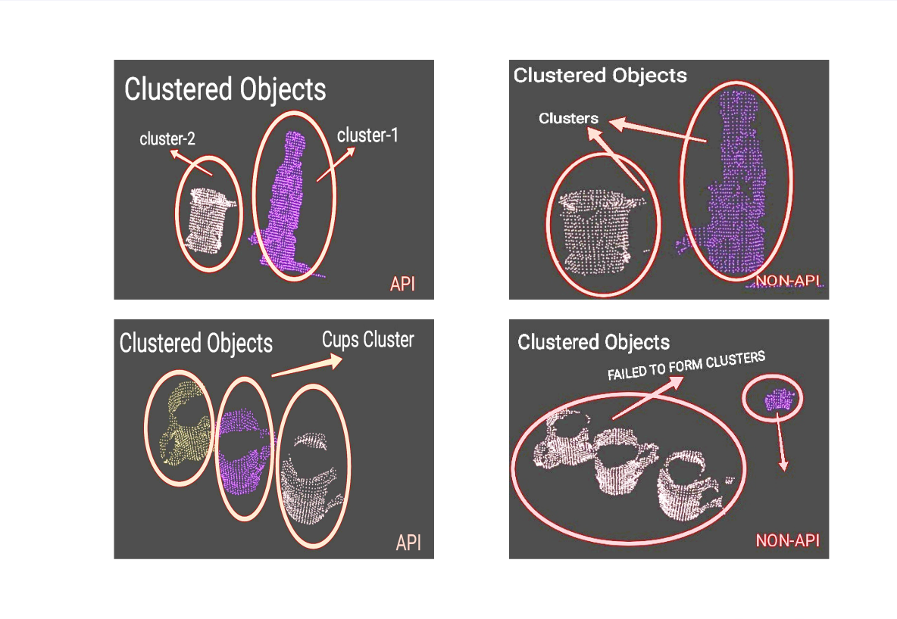
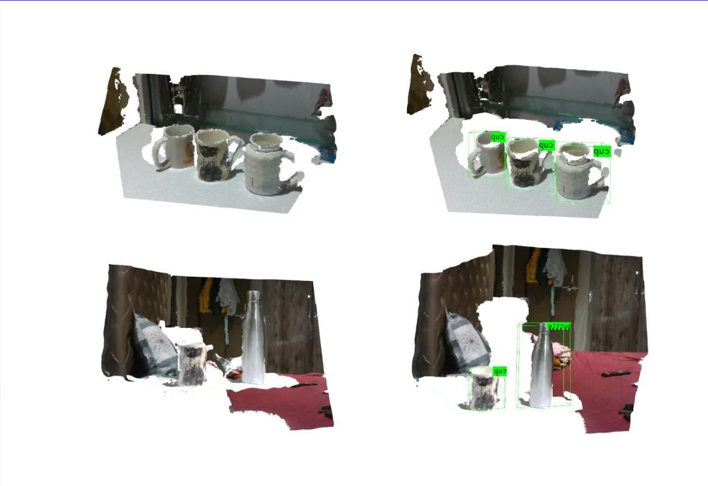

A robotics engineer with over 3.5 years of experience in research, development & teaching adjunct with a strong background in mathematics & hardware engineering, aiming to build optimized & robust applications for economical use.

## Education

| Degree        | School/University          | GPA | Graduation |
|:-------------|:------------------|:------|
| MSc [Robotics & Autonomous System](./content/Education/MSc.html), Electrical Engineering Dept. | Arizona State University, USA | 4.0 | August 2022 - _Present_  |
| Parttime P.G., Department of Systems & Control Engineering | IIT-Bombay, India   | 3.5 | July 2021 - June 2022  |
| B.E Electronics           | University of Mumbai, India      | 3.19 | July 2018   |

* * *

## Research Experience

## Teaching Experience

## Work Experience

## Projects

- [Higher Dimensional Mandelbrot & Julia using Geometric Algebra]()

STAM Center, ASU

- Random Osciloscope ??

- Novozymes Enzyme Stability Prediction ASU

- Agribot, IIT Bombay

- [Accelerated 3D-Perception IIT Bombay]()

<!-- <object>
<embed src="./content/projects/media/e_YSIP21_21_3D_Perception_progress_ppt_II.pdf" type="application/pdf" width="600px" height="400px">
</object> -->

- Sahayak Bot | IIT Bombay

- Depth Perception | IIT Bombay

- Quadcopter Stabilization in Gazebo | IIT Bombay

