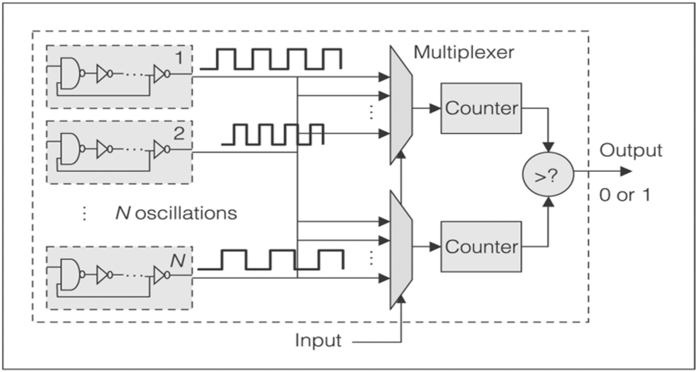
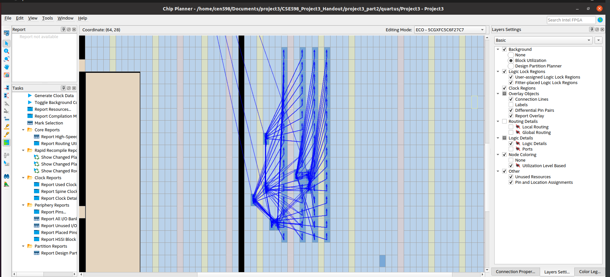

A robotics engineer with over 3.5 years of experience in research, development & teaching adjunct with a strong background in mathematics & hardware engineering, aiming to build optimized & robust applications for economical use.

## Education

| Degree        | School/University          | GPA | Graduation |
|:-------------|:------------------|:------|
| MSc [Robotics & Autonomous System](./content/Education/MSc.html), Electrical Engineering Dept. | Arizona State University, USA | 4.0 | August 2022 - _Present_  |
| Parttime P.G., Department of Systems & Control Engineering | IIT-Bombay, India   | 3.5 | July 2021 - June 2022  |
| B.E Electronics           | University of Mumbai, India      | 3.19 | July 2018   |

* * *

## Work Experience

### Indian Institute of Technology, Mumbai, India

> Position: Sr Project Technical Assistant 

> Duration: Dec 2018 – July 2022

Responsible for developing more than eight robotics & RTOS application under the supervision of Prof Kavi Arya, CSE Dept, IIT Bombay, to conceptualise them through 3 different teaching pedagogy.

- Led a team of 6 in the design & development of UGV (with UR5 mount) & drones (Quadcopters & Octocopters) for generic applications.

- Taught undergraduate students through designing & managing international robotics competitions, (eYRC) eYantra Robotics Competition. Curated 3 editions in the year 2019, 2020 & 2021 with 3675, 1771 & 897 students respectively.

- Created MOOCs in ROS & Embedded Systems, drone Simulation models in Gazebo & real applications for teaching & research purposes, with yearly 4000+ participants.

- Mentored 14 interns & guided them in various robotics projects in an annual internship program at (Embedded & Real-time Systems) ERTS Lab.

- Fortified auto-grading python scripts for efficient evaluation of 1000+ bag(log) files containing extensive telemetric data for the system’s
performance analysis.

- Developed & facilitated 2-day workshops on the topic “Introduction to Embedded Systems”. Trained 180+ college faculties from 65+ engineering colleges across India

## Featuring Projects

- [Higher Dimensional Mandelbrot & Julia using Geometric Algebra](), STAM Center- ASU

- [Ring Oscillators PUF](), ASU

  >
  - Desiging a PUF (Physically Unconneble device), as a part of the CEN 598 course.

- [Flash-Memory Dev-board for FPGA]()

<object>
<embed src="./content/projects/media/Generic-flash-memory-PCB-layout-&-design.pdf#page=1&zoom=60" type="application/pdf" width="600px" height="400px">
</object>

- [Novozymes Enzyme Stability Prediction](), STAM-Center ASU

  > Source: [Kaggle Competition](https://www.kaggle.com/competitions/novozymes-enzyme-stability-prediction/discussion) 
  - RNN-LSTM model with R2 94% accuracy score, for predicting thermal stability of amino acids sequential data.

- [Agribot](), IIT Bombay

  > [Demonstration](https://youtu.be/cgiHJSOUb5I)  
  > [Resource](https://github.com/erts-RnD/eYRC-2021_Agribot)
  - Autonomous UGV with UR5 in actual Greenhouse with remote access. Paper under review (Continuation of Sahayak Bot project).
  - Bolster distant hands-on learning for 20+ students in isolated corners of India.

- [Accelerated 3D-Perception IIT Bombay]()

  > [Reference](https://arxiv.org/pdf/2006.00049.pdf)
  - 3D data filter pipeline developed using Point Cloud Library, adjunct with CNN model for object recognition.
  - Aim to alleviate price & energy requirements by implementation on Xilinx’s Ultra96 MPSoC using Vivada HLS language.
  
  

<!-- <object>
<embed src="./content/projects/media/e_YSIP21_21_3D_Perception_progress_ppt_II.pdf" type="application/pdf" width="600px" height="400px">
</object> -->

- [Sahayak Bot](), IIT Bombay

  > **[Publication]()**  
  > [Resources](https://github.com/erts-RnD/sahayak_bot)
  - Development of a UGV with UR5, both actual & simulation models for generic autonomous pick-&-place and navigation applications.
  - Facilitated teaching 5446 students the challenges associated with industrial robotics to date.

- [Depth Perception](), IIT Bombay

  > **[Publication](https://ieeexplore.ieee.org/document/9588784)**  
  > [Resources](https://github.com/erts-RnD/sahayak_bot)
  - Study of 3 vSLAM (Computer vision) methods, PTAM, ORB-SLAM2 & CNN model, to generate point cloud data, & mapping with an onboard monocular camera on a DJI Tello drone.

- [Quadcopter Stabilization in Gazebo](), IIT Bombay

  > [Resources](https://github.com/rishikeshrmadan/survey_and_rescue)
  - Enabled 0 cost learning through building a custom simulation model of a nano-drone in the Gazebo simulator, based on the RotorS framework (LQR controller). Adjunct with Image-processing for waypoint detection & path-planning.

- [Data Traffic Monitor System](), University of Mumbai
  
  > **BE Thesis Project**
  - An RTOS system with a 6.5ftx3ft physical board, depiction college's IT infrastructure & relaying latency information of any node within the intra-network.
  - Similar information conveyed through website. Concepts like RTOS, signal processing & multithreading enabled the system to perform calculations & information broadcasting within 200ms.
